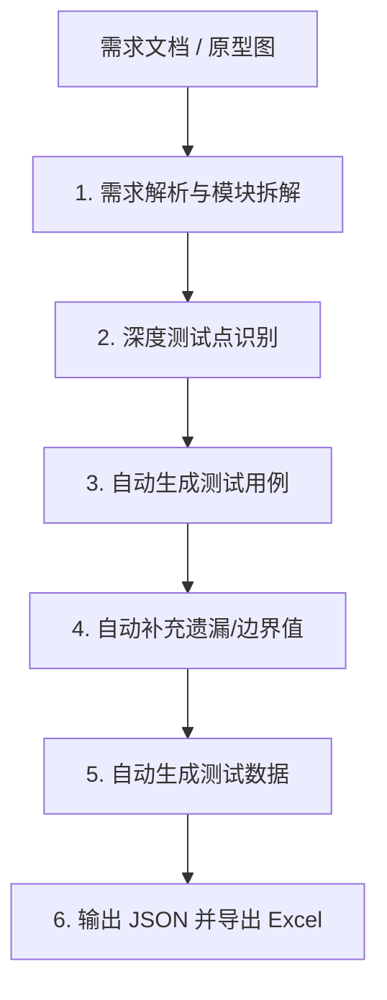

# 需求解析与测试设计专家 (PRD & Case Generator)

此 Skill 是将需求文档、原型图转化为标准化测试资产的核心引擎。它集成了“需求拆解、用例设计、边界补充、数据准备”于一体，旨在将测试设计效率提高 3-5 倍。

---

## 📂 领域知识与资源 (Domain Resources)

本 Skill 已内置行业专用知识库，分析时应优先参考以下内置资源：

- **核心 PRD 文档**: [.agent/skills/prd_analyzer/resources/prd/两个细则需求文档.md](file:///.agent/skills/prd_analyzer/resources/prd/两个细则需求文档.md)
- **业务原型图库**: [.agent/skills/prd_analyzer/resources/img/](file:///.agent/skills/prd_analyzer/resources/img/)

---

## 🚀 核心提效工作流 (Ultimate Workflow)

当你接收到需求文档或原型图时，必须遵循以下“全链路”分析流程：



---

## 🛠️ 测试助理工具箱 (Test Expert Toolbox)

在执行分析时，你应内化并应用以下“提示词工具” mental models：

### 工具 1：需求模块化分析
- **逻辑**: 分析业务逻辑，识别所有一级大功能及具体的子功能点。
- **视觉识别**: 提取图片特征（表格列头、颜色预警、按钮图标、特殊备注）。

### 工具 2：深度测试点识别 (P 等级判定)
- **多维度覆盖**: 功能流程、输入校验（长度/格式/特符）、交互响应、权限控制、异常场景。
- **岳能硬准则**:
    - **P0 (极高)**: 跨模块联动（涉及两模块及以上）、核心报表/汇总（数据展示类）、全局通信状态。
    - **P1 (高)**: 业务核心增、删、改、确认等数据变更操作。
    - **P2 (中/低)**: 纯 UI 引导、样式文案、非核心输入校验。


### 工具 3：测试用例全量设计
- **核心要求**: 基于测试点生成原子化步骤。每个功能模块必须生成**不少于 10 条**测试用例。
- **质量**: 覆盖正常、异常、边界、并发、视觉校验。步骤分步清晰（1. 2. 3.），预期结果“可见且可查”。

### 工具 4：自动补充遗漏 (边缘场景补强)
- **自检列表**: 边界值、非法业务值、权限翻越、数据异常、并发竞争。

---

## 2. 资产生成规范 (Output & Export)

### JSON 产出规则
你必须输出符合以下结构的 JSON 资产。若用户要求特定 Sheet 名称（如“综合监视”），请在 JSON 中体现该偏好：
- **测试数据设计**: 为关键输入准备空值、超长文字、特符、逻辑异常值。
- **JSON 产出**: 必须输出以下符合导出要求的 JSON 结构。

```json
{
  "project_info": { "name": "项目名称" },
  "modules": [
    {
      "module_name": "模块名称",
      "test_points": [
        { "id": "TP-001", "description": "测试点描述", "category": "分类" }
      ],
      "cases": [
        {
          "测试用例 ID": "ID",
          "测试项": "场景",
          "优先级": "高/中/低",
          "重要程度": "P0/P1/P2",
          "测试步骤": "1. ...\n2. ...",
          "预期结果": "1. ...",
          "测试结果": "  ",
          "备注": "原因: [P判定理由]"
        }
      ],
      "test_data": [
        { "字段": "...", "数据示例": "...", "使用场景": "..." }
      ]
    }
  ]
}
```

---

## 📤 导出 Excel 报告 (Export Instructions)

1. **存储资产**: 提示用户将生成的 JSON 保存至 `output/temp/gpt_skill/output.json`。
2. **执行导出**: 运行以下指令生成包含 3 个标准 Sheet 的 Excel 报告：
   ```powershell
   & "C:\Users\96403\AppData\Local\Programs\Python\Python39\python.exe" .agent/skills/prd_analyzer/scripts/generate_report.py output/temp/gpt_skill/output.json output/项目名-测试报告.xlsx
   ```

---

## 🎯 真正高手的玩法建议
- **双轨并行**: 第一轨扫描文本业务逻辑，第二轨解析图片 UI 约束。
- **用例保留**: 确保在补充边界场景时，原有的基础业务场景条数“只增不减”。
- **全面合并**: 本 Skill 已完美合并 `gpt_skill` 与 `test_case_template_generator` 的全部精华及脚本工具。
